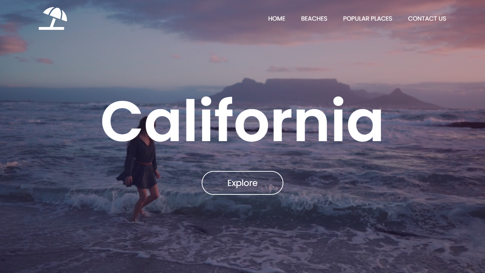

# Website-Modern-Video-Background
<h3>EN - Modern website with video as background using only HTML and CSS;</h3>
<h3>PT - Website Moderna com video como background usando apenas HTML e CSS;</h3>
<h4>Deploy: https://johnandrade65.github.io/Website-Modern-Video-Background/</h4>

 
  
  

